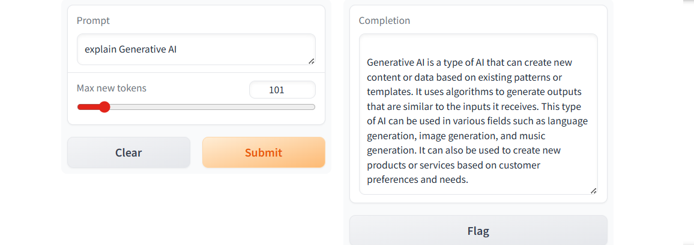

## Development and Deployment of a 'Chat with LLM' Application Using the Gradio Blocks Framework

### AIM:
To design and deploy a "Chat with LLM" application by leveraging the Gradio Blocks UI framework to create an interactive interface for seamless user interaction with a large language model.

### PROBLEM STATEMENT:
Building a user-friendly application that allows seamless interaction with a large language model (LLM) is challenging without requiring specialized API keys or external resources. This project addresses the need for an accessible, open-source solution to implement such applications using pre-trained models and the Gradio Blocks framework.

### DESIGN STEPS:
#### STEP 1:

Import Required Libraries. Install and import the necessary libraries: Gradio for the UI. Transformers for using pre-trained models.

#### STEP 2:

Use a pre-trained model like GPT-2 or DialoGPT from Hugging Face.Initialize the model using the pipeline API for straightforward interaction.

#### STEP 3:

Run the application locally with demo.launch(). Optionally deploy it to the cloud for broader accessibility.

### PROGRAM:
```
import gradio as gr
def generate(input, slider):
    output = client.generate(input, max_new_tokens=slider).generated_text
    return output

demo = gr.Interface(fn=generate, 
                    inputs=[gr.Textbox(label="Prompt"), 
                            gr.Slider(label="Max new tokens", 
                                      value=20,  
                                      maximum=1024, 
                                      minimum=1)], 
                    outputs=[gr.Textbox(label="Completion")])

gr.close_all()
demo.launch(share=True, server_port=int(os.environ['PORT1']))
```
### OUTPUT:


### Result:
Thus the Chat with LLM Application Using the Gradio Blocks Framework is created successfully.
